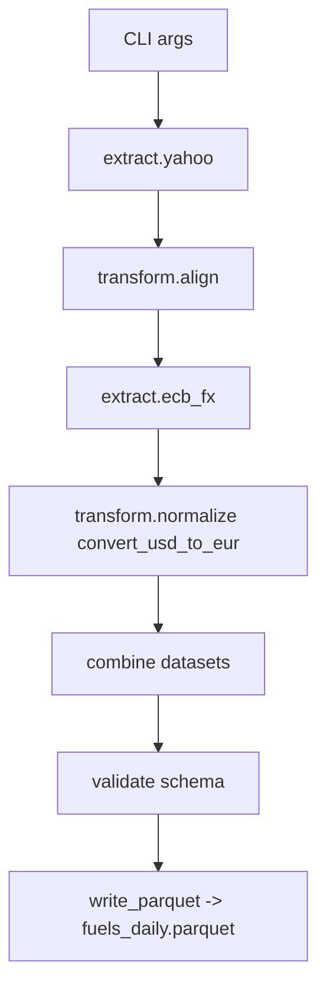

## 📘 Draft Technical Specification

### Project: `markets-fuels`

**Version:** 0.1-draft  **Date:** 2025-10-31
**Maintainer:** Volatility Spillovers Project

---

### 1 . Purpose

To provide reproducible, daily-frequency market and fuel price time series for European volatility and spillover studies.
The output harmonizes disparate sources into a single long-format parquet dataset with unified metadata, currency normalization, and confidence flags (`is_estimated`, `is_ffill`).

---

### 2 . Scope and Series

| Series              | Symbol (output)                  | Unit                 | Native Currency | Free Source                                                                                                            | Frequency | License / Access                 |
| :------------------ | :------------------------------- | :------------------- | :-------------- | :--------------------------------------------------------------------------------------------------------------------- | :-------- | :------------------------------- |
| Brent Crude         | `brent_usd_bbl`, `brent_eur_bbl` | USD / EUR per barrel | USD             | Yahoo Finance (`BZ=F`)                                                                                                 | Daily     | Free for non-commercial research |
| TTF Natural Gas     | `ttf_eur_mwh`                    | EUR / MWh            | EUR             | [ICE TTF Front-Month](https://markets.businessinsider.com/commodities/ttf-gas-price) proxy (Investing.com CSV mirrors) | Daily     | Free display / scrape permitted  |
| API2 Rotterdam Coal | `api2_usd_ton`, `api2_eur_ton`   | USD / EUR per tonne  | USD             | [World Bank Commodity “Coal, Europe (API2)” series PCOALAU](https://databank.worldbank.org/source/commodity-prices)    | Monthly   | CC-BY 4.0                        |
| EUA (EU ETS Carbon) | `eua_eur_t`                      | EUR / tonne CO₂      | EUR             | [Ember EU ETS Carbon Price](https://ember-climate.org/data/carbon-price-viewer)                                        | Daily     | CC-BY 4.0                        |
| Euro STOXX 50 Index | `stoxx_px`                       | Index level          | EUR             | Yahoo Finance (`^STOXX50E`)                                                                                            | Daily     | Free                             |
| IBEX 35 Index       | `ibex_px`                        | Index level          | EUR             | Yahoo Finance (`^IBEX`)                                                                                                | Daily     | Free                             |
| CAC 40 Index        | `cac_px`                         | Index level          | EUR             | Yahoo Finance (`^FCHI`)                                                                                                | Daily     | Free                             |
| PSI 20 Index        | `psi20_px`                       | Index level          | EUR             | Yahoo Finance (`^PSI20`)                                                                                               | Daily     | Free                             |
| EUR/USD FX          | —                                | ratio                | —               | [ECB Statistical Data Warehouse (EXR.D.USD.EUR.SP00.A)](https://sdw.ecb.europa.eu/browse.do?node=9691315)              | Daily     | Public domain                    |

---

### 3 . Transformation Rules

| Operation                     | Description                                           | Flag(s)             |
| :---------------------------- | :---------------------------------------------------- | :------------------ |
| Currency normalization        | Multiply USD series by daily `usdeur = 1 / EURUSD`.   | `is_estimated=True` |
| Calendar alignment            | Reindex to business days; drop weekends.              | —                   |
| Monthly → daily interpolation | Forward-fill within month boundaries.                 | `is_ffill=True`     |
| Source merging                | Stack all sources vertically with schema enforcement. | —                   |

---

### 4 . Schema

| Field          | Type             | Description                                  |
| :------------- | :--------------- | :------------------------------------------- |
| `date`         | `datetime64[ns]` | UTC calendar date                            |
| `series`       | `str`            | canonical identifier                         |
| `value`        | `float64`        | numeric observation                          |
| `is_estimated` | `bool`           | derived from another currency or conversion  |
| `is_ffill`     | `bool`           | true if propagated from lower-frequency data |
| `source`       | `str`            | origin URI or tag                            |

Validated via `pandera` schema (`mf.contracts.FuelsSchema`).

---

### 5 . Dependencies

| Library           | Purpose                      |
| :---------------- | :--------------------------- |
| `pandas`, `numpy` | time-series ops              |
| `yfinance`        | Yahoo Finance extraction     |
| `requests`        | HTTP for ECB SDW, World Bank |
| `typer`           | CLI                          |
| `pandera`         | schema validation            |
| `pyarrow`         | parquet I/O                  |

---

### 6 . Processing Flow

---

### 7 . Output

* File: `fuels_daily.parquet`
* Size: ~few MB per year
* Encoding: Arrow / Parquet, compression = snappy
* Reproducibility: deterministic given source dates and versions.

---

### 8 . Validation & Testing

| Test                 | Purpose                           |
| :------------------- | :-------------------------------- |
| Unit – FX conversion | USD→EUR arithmetic integrity      |
| Unit – Forward-fill  | Monthly→daily logic               |
| Contract             | Schema compliance                 |
| CI                   | 3-day fetch window to reduce load |

---

### 9 . Future Extensions

* Automate EUA daily ingest via Ember API.
* Add TTF spot series via EEX/Investing CSV.
* Include derived EUR/MWh equivalents (Brent energy conversion).
* Add OECD industrial production series for joint normalization.

---

### 10 . References (Free/Public)

1. **ECB SDW** – Exchange rates dataset (“EXR.D.USD.EUR.SP00.A”): [https://sdw.ecb.europa.eu](https://sdw.ecb.europa.eu)
2. **Yahoo Finance** API via `yfinance`: [https://pypi.org/project/yfinance/](https://pypi.org/project/yfinance/)
3. **World Bank Commodity Prices – Pink Sheet**: [https://databank.worldbank.org/source/commodity-prices](https://databank.worldbank.org/source/commodity-prices)
4. **Ember EU ETS Carbon Price** dataset: [https://ember-climate.org/data/carbon-price-viewer](https://ember-climate.org/data/carbon-price-viewer)
5. **Investing.com Energy Commodities** (used as TTF proxy): [https://www.investing.com/commodities](https://www.investing.com/commodities)
6. **STOXX and national indices** tickers (Yahoo!): documentation via [https://finance.yahoo.com](https://finance.yahoo.com)

